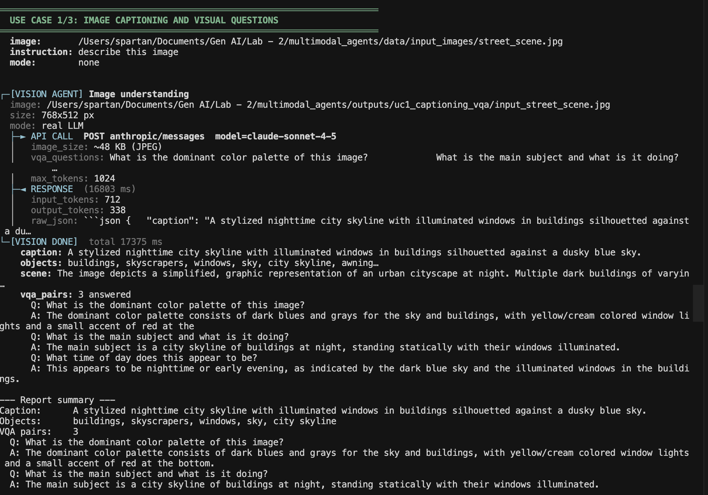
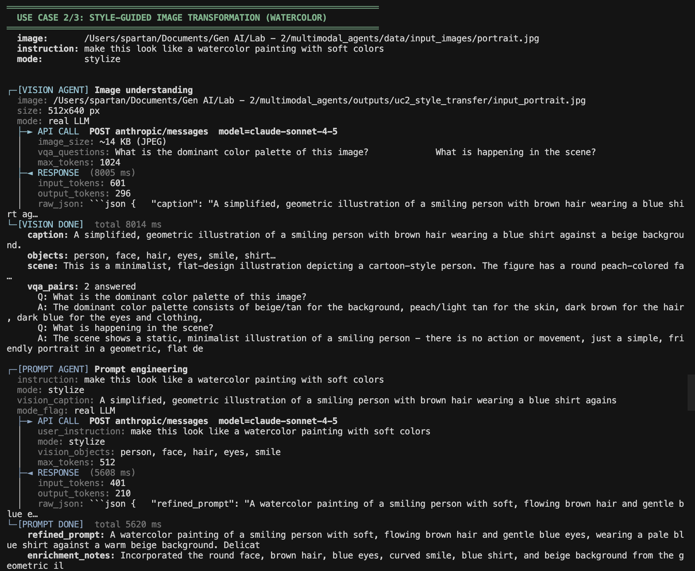
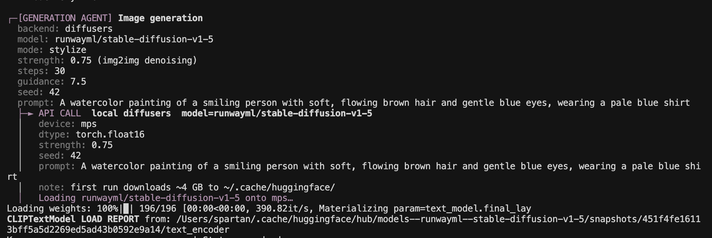
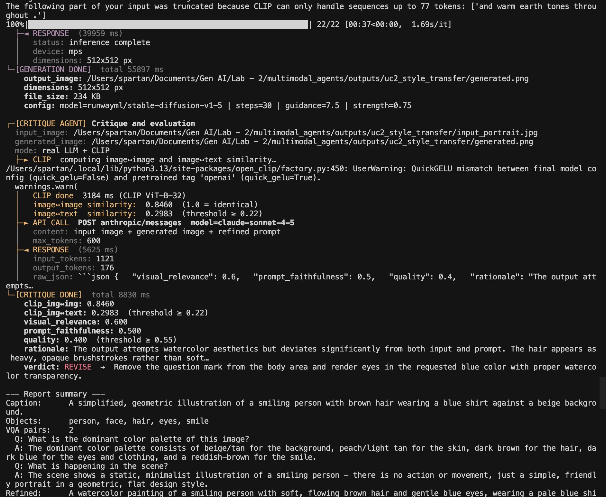
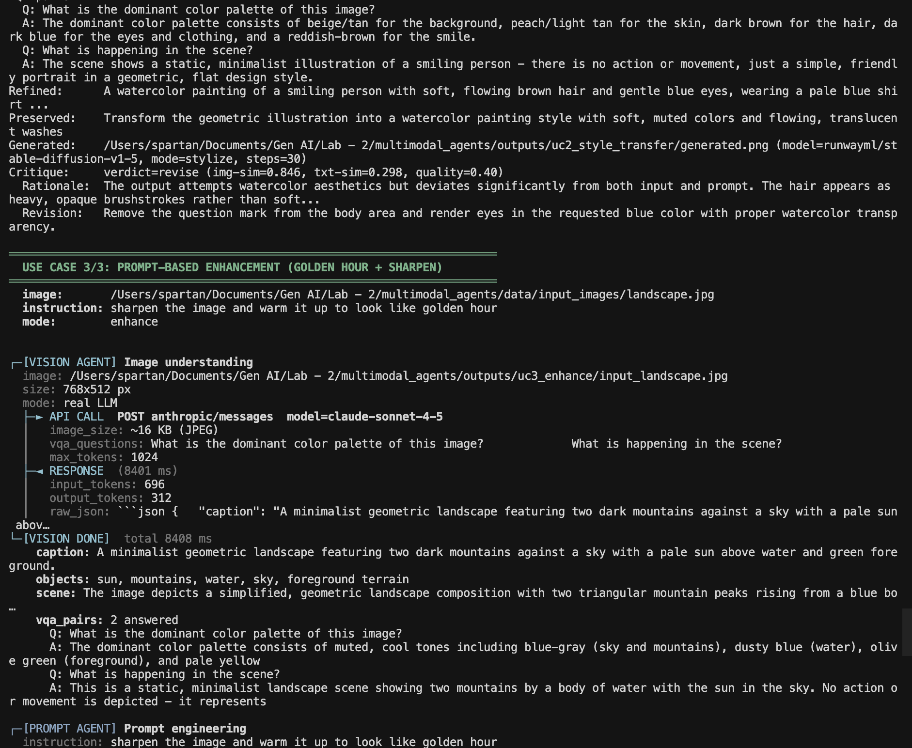
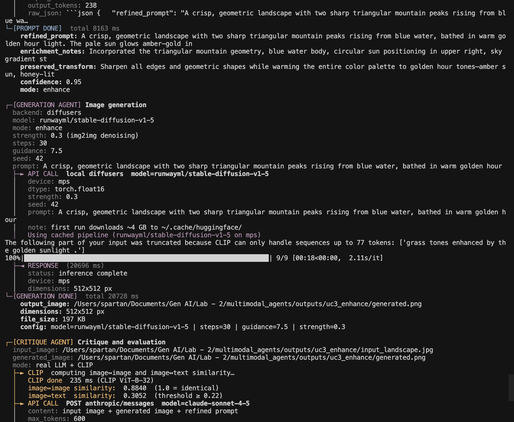
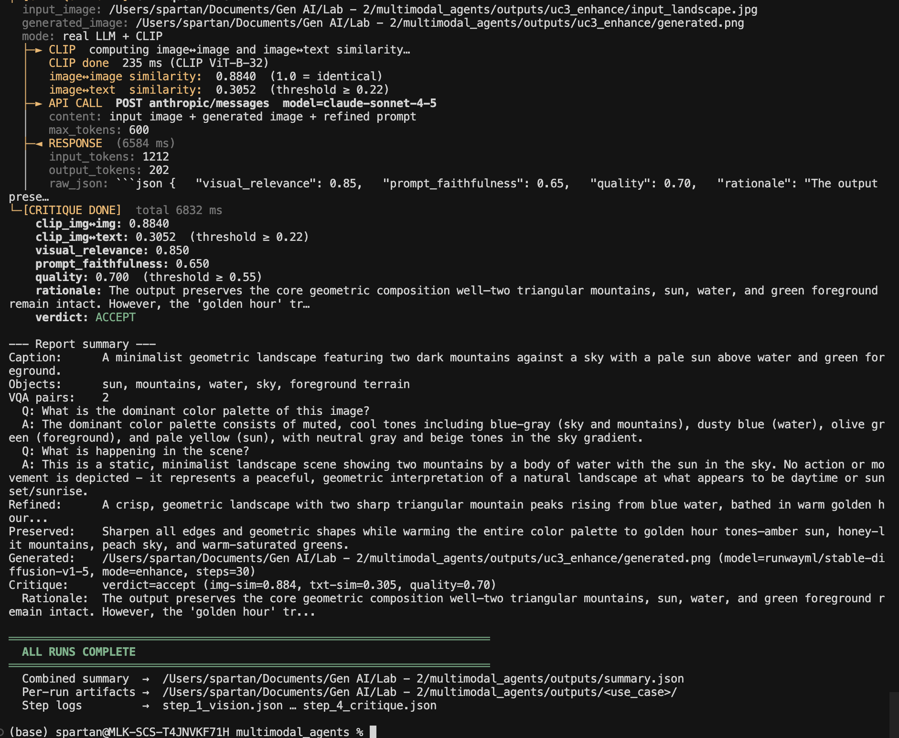

# AgentLens

A multimodal multi-agent pipeline that **sees**, **thinks**, **generates**, and **evaluates** — powered by Claude Sonnet 4.5 and Stable Diffusion 1.5.

```
Input image + natural-language instruction
          │
          ▼
  ┌───────────────┐
  │  VisionAgent  │  Claude Sonnet 4.5 — caption · objects · scene · VQA
  └──────┬────────┘
         │  VisionOutput
         ▼
  ┌───────────────┐
  │  PromptAgent  │  Claude Sonnet 4.5 — rewrites & enriches the instruction
  └──────┬────────┘
         │  RefinedPrompt
         ▼
  ┌──────────────────┐
  │ GenerationAgent  │  SD 1.5 (local, no API key) — stylize · enhance · variation
  └──────┬───────────┘
         │  GenerationResult
         ▼
  ┌────────────────┐
  │ CritiqueAgent  │  CLIP ViT-B-32 + Claude — accept / revise verdict + rationale
  └────────────────┘
```

Every agent is an independent module. Outputs are typed dataclasses. The pipeline saves full JSON logs after each step — nothing is a black box.

---

## Three Use Cases

### UC1 — Image Captioning & Visual Questions

> **Input:** Urban street scene  
> **Instruction:** `"describe this image"`  
> **Mode:** `none` — vision only, no generation

| Input |
|:---:|
|  |

**What happens:** The Vision agent calls Claude with the image and returns a structured JSON containing a caption, list of objects, a scene description, and answers to 3 visual questions.

**Terminal output:**



---

### UC2 — Style-Guided Image Transformation

> **Input:** Portrait illustration  
> **Instruction:** `"make this look like a watercolor painting with soft colors"`  
> **Mode:** `stylize` — high denoising strength (0.75)

| Input | Output |
|:---:|:---:|
|  |  |

**What happens:** Vision → Prompt → Generation (SD 1.5, 22 steps on MPS) → Critique (CLIP + LLM). The critique agent correctly issued **REVISE** — the SD 1.5 model added opaque brushstroke artifacts and ignored the "blue eyes" detail. The rationale is logged and a specific revision suggestion is returned.

**Terminal output:**





---

### UC3 — Prompt-Based Enhancement

> **Input:** Minimalist landscape illustration  
> **Instruction:** `"sharpen the image and warm it up to look like golden hour"`  
> **Mode:** `enhance` — low denoising strength (0.30)

| Input | Output |
|:---:|:---:|
|  |  |

**What happens:** The prompt agent enriches the 12-word instruction into a ~110-word golden-hour description. SD 1.5 applies a light enhancement pass (strength 0.30 preserves most of the input geometry). CLIP img↔img = 0.884 confirms high fidelity. Verdict: **ACCEPT**.

**Terminal output:**







**Pipeline summary:**



---

## Quickstart

### No API keys — stub mode (default)

```bash
pip install -r requirements.txt
python run_demo.py
```

Runs all three use cases with deterministic stubs — no GPU, no API keys.

### Real mode — Claude + local SD 1.5

```bash
cp .env.example .env
# Add your ANTHROPIC_API_KEY to .env
source .env
python run_demo.py
```

SD 1.5 runs **locally** via `diffusers`. Auto-detects Apple Silicon (MPS), NVIDIA (CUDA), or CPU. ~4 GB download on first run, cached after that.

### Generation backends

| Backend | Env var | Requires |
|---|---|---|
| `diffusers` *(default)* | `GENERATION_BACKEND=diffusers` | No API key — local SD 1.5 |
| Stability AI | `GENERATION_BACKEND=stability` | `STABILITY_API_KEY` |
| Replicate | `GENERATION_BACKEND=replicate` | `REPLICATE_API_TOKEN` |

---

## Output artifacts

Every run produces a full set of artifacts under `outputs/<run_id>/`:

```
outputs/uc3_enhance/
├── input_landscape.jpg        ← copy of input
├── step_1_vision.json         ← VisionOutput (caption, objects, VQA)
├── step_2_prompt.json         ← RefinedPrompt (rewrite, enrichment, transform)
├── step_3_generation.json     ← GenerationConfig (model, steps, seed, strength)
├── step_4_critique.json       ← Critique (CLIP scores, LLM scores, verdict)
├── report.json                ← full RunReport (all agents combined)
└── generated.png              ← output image
```

---

## Evaluation

The Critique agent runs two evaluations in parallel:

**Automatic (CLIP ViT-B-32)**
- `clip_similarity_image` — how similar is the output to the input? (content preservation)
- `clip_similarity_text` — how well does the output match the refined prompt? (instruction fidelity)

**LLM-based (Claude Sonnet 4.5)**
- `visual_relevance`, `prompt_faithfulness`, `quality` — three 0–1 scores
- `rationale` — a natural language critique paragraph
- `verdict` — `accept` or `revise`, with a concrete `revision_suggestion` if revising

| Use Case | CLIP img↔img | CLIP txt↔img | Quality | Verdict |
|---|---|---|---|---|
| UC2 — Watercolor | 0.846 | 0.298 | 0.40 | REVISE |
| UC3 — Golden Hour | 0.884 | 0.305 | 0.70 | ACCEPT |

Human evaluation was performed on 5 runs using a 5-criterion rubric. Human and agent verdicts agreed on all 5 (100%). See [`examples/human_eval_sheet.csv`](examples/human_eval_sheet.csv).

---

## Failure handling

The pipeline never crashes. Every error type is caught and logged in `report.json["errors"]`:

| Scenario | What happens |
|---|---|
| Ambiguous / too-short instruction | `AmbiguousPromptError` — partial report returned |
| Missing or unreadable image | `LowQualityImageError` — raised pre-run |
| Low-confidence vision output | `low_quality_input=True` flag — pipeline continues with warning |
| Generation backend failure | `GenerationResult.error` set — critique skipped, partial report returned |

---

## Project layout

```
agentlens/
├── agents/
│   ├── vision_agent.py        ← Claude Sonnet 4.5, image → caption + VQA
│   ├── prompt_agent.py        ← Claude Sonnet 4.5, instruction → refined prompt
│   ├── generation_agent.py    ← SD 1.5 local (diffusers), 3 modes
│   └── critique_agent.py      ← CLIP + Claude, accept/revise verdict
├── orchestration/pipeline.py  ← sequential agent runner, JSON step logs
├── utils/
│   ├── schemas.py             ← typed dataclass contracts between agents
│   ├── errors.py              ← AmbiguousPromptError, LowQualityImageError
│   ├── clip_utils.py          ← CLIP similarity (open_clip ViT-B-32)
│   └── logger.py              ← color-coded terminal logging
├── tests/
│   ├── test_pipeline.py       ← 12 stub-mode unit + integration tests
│   └── test_real_mode.py      ← 54 real-API tests
├── examples/
│   ├── human_eval_rubric.md   ← 5-criterion scoring guide
│   └── human_eval_sheet.csv   ← 5 scored runs
├── assets/                    ← input/output images + terminal screenshots
├── data/input_images/         ← sample input images
├── REPORT.md                  ← full lab report (all 3 parts)
├── run_demo.py                ← entry point
├── config.py                  ← mode switches, model selection
└── requirements.txt
```

---

## Tests

```bash
pytest tests/ -v                                     # stub — no keys needed
STUB_MODE=0 pytest tests/test_real_mode.py -v        # real API
```

---

## Use your own image

```python
from orchestration import MultimodalPipeline

pipeline = MultimodalPipeline()
report = pipeline.run(
    image_path="path/to/your/image.jpg",
    instruction="turn this into a watercolor painting",
    mode="stylize",          # stylize | enhance | variation
)
print(report.critique.verdict)          # "accept" or "revise"
print(report.critique.rationale)        # why
print(report.critique.revision_suggestion)  # what to fix if revising
```
